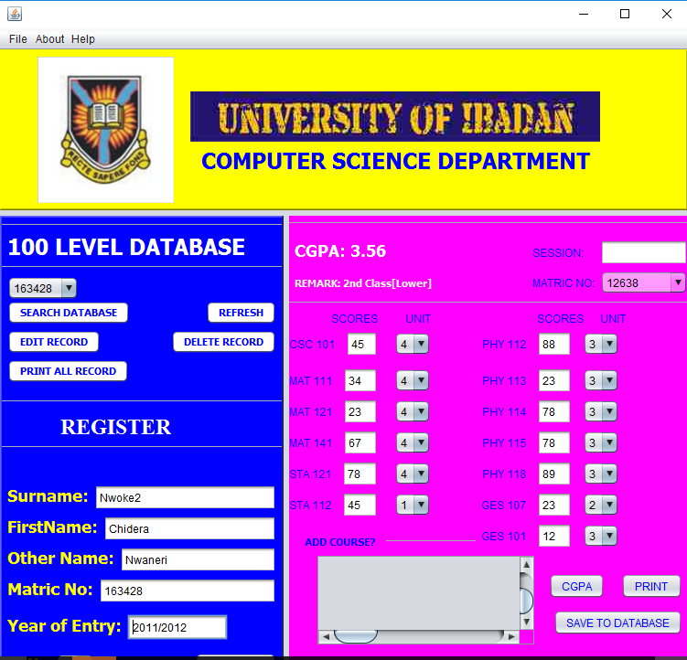
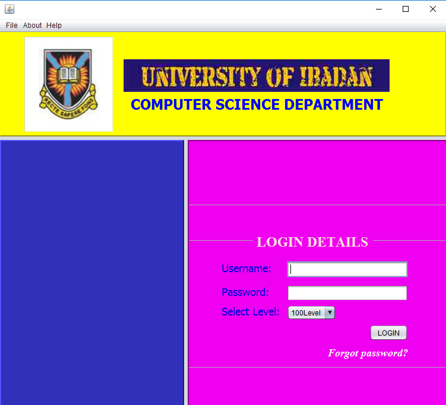

CGPA Calculator helps in the computation of student's cummulative grade and print transcript.





## Installation

### Requirements
    *Java: JDK >= 7
    *Database: Mysql >= 5.5

<br><br>

###How to install
    *Clone Repo
    *Run the sql dump compdept.sql
    *Set Database configuration in src/Backhand/SunDB2.java
    ``` public final String url = "jdbc:mysql://localhost:3306/compdept";
        public final String userName = "root";
        public final String password = "";
        public String query= "SELECT * FROM `info2011_12`";
    ```

Run CgpaINterface.java
Username: admin
Password: admin

## License

CGPA calculator is licensed under the [MIT license](https://opensource.org/licenses/MIT).


